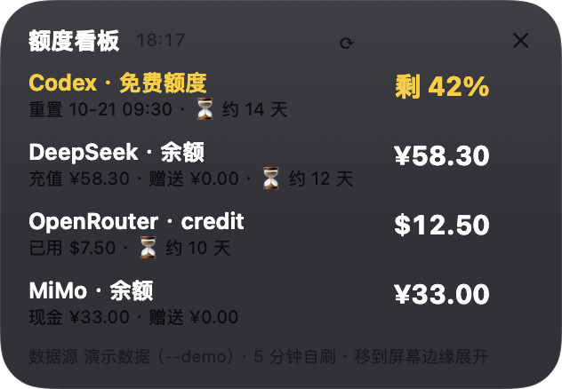
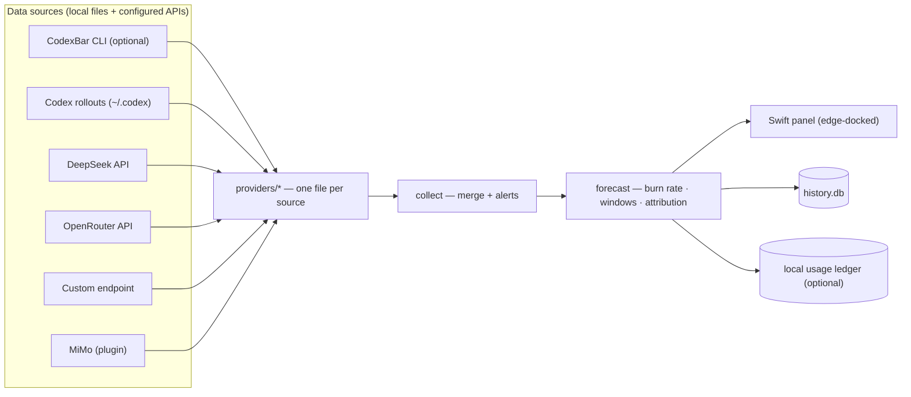

# llm-board

[](https://github.com/majn4-hub/llm-board/actions/workflows/ci.yml)

A macOS panel that answers **two questions** about your AI credits — nothing else:

1. **How long will they last?** Balance + burn rate → days left & estimated depletion date.
2. **Who spent the money?** Local usage attribution by provider / session / task.



*Screenshot generated with `llm-board collect --demo` — every value in it is fabricated.*

The panel docks to the edge of your screen and slides out when the mouse reaches it. Drag it anywhere and release — it snaps to the nearest edge of the current screen (multi-display aware).

## Privacy

llm-board is **local-first by design**. Nothing leaves your machine:

- **No telemetry, no analytics, no cloud.** Nothing about you or your usage is sent anywhere. The only outbound requests are the balance APIs you configure yourself, plus one reachability probe (a HEAD request carrying no data) used to check whether your local proxy is actually online.
- It only reads **local files** (e.g. Codex session snapshots under `~/.codex`) and calls **the balance APIs you explicitly configure** (DeepSeek, OpenRouter, …).
- Attribution is powered by a **local usage ledger** (a SQLite file you point it at). It is **disabled until you configure `[paths] ledger_db`**, and it only reads — nothing is uploaded anywhere.
- The optional MiMo plugin (off by default) reads its balance through your local browser session, because that is the only way that balance is exposed.

Every run is auditable: `llm-board collect --once` prints exactly what it collected, and `llm-board collect --demo` shows a fully fabricated sample without touching anything.

## How it's different

| | llm-board | CodexBar / token-monitor |
|---|---|---|
| Focus | **Depletion forecast + spend attribution** | Provider coverage / menu-bar tooling |
| Form factor | Edge-docked panel | Menu bar |
| Scope | Narrow & deep: two questions | Broad |

It complements existing tools: when CodexBar is installed, its official readings are used where available, and llm-board adds the "how long / who spent" layer on top.

## Install

Requirements: macOS, Python ≥ 3.11. Optional: [CodexBar](https://github.com/steipete/CodexBar).

```bash
git clone https://github.com/majn4-hub/llm-board
cd llm-board
python3 -m venv .venv
.venv/bin/pip install -e .
.venv/bin/llm-board setup        # creates ~/.config/llm-board/{config.toml,ui.json}
```

Edit `~/.config/llm-board/config.toml` (API keys, proxy, providers…), then verify:

```bash
.venv/bin/llm-board collect --once   # prints what it collected (JSON)
.venv/bin/llm-board forecast         # the report: days-left table + attribution
```

### Desktop panel

```bash
swiftc -O -swift-version 5 src/ui/llm_monitor_desktop.swift -o bin/llm-monitor
./bin/llm-monitor
```

The panel reads `~/.config/llm-board/ui.json` for its collector command and refresh interval.

### Sample report (demo data)

```text
$ llm-board forecast --demo

# ⏳ 续航预测（2026-09-17 18:15 · 演示数据（--demo，未联网））

| 通道 | 当前 | 日均消耗 | 还能用 | 预计耗尽 | 速度来源 |
|---|---:|---:|---:|---|---|
| Codex | 剩 42% | 3.000%/天 | 14.0 天 | （10-21 重置） | Codex 本地记录（3.0 天） |
| DeepSeek | ¥58.30 | 4.858CNY/天 | 12.0 天 | 09-29 | 余额历史（3.0 天） |
| OpenRouter | $12.50 | 1.250USD/天 | 10.0 天 | 09-27 | 本地用量账本（14 天） |
| MiMo | ¥33.00 | —CNY/天 | — | 数据积累中（需 ≥4 小时） | — |
```

## Configuration

[`config.example.toml`](config.example.toml) is the full annotated example (auto-generated on first run). Highlights:

| Section | What it controls |
|---|---|
| `[general]` | refresh interval, forecast window |
| `[proxy]` | local proxy for overseas APIs (empty = direct) |
| `[paths]` | codex home, history DB, ledger DB, legacy `.env` |
| `[providers.*]` | per-provider enable / API keys |
| `[plugins.mimo]` | browser-bridge plugin (off by default) |
| `[alerts.*]` | warning thresholds |

Credentials priority: `config.toml` value → environment variable → legacy `.env` file.

## Providers

Each provider is a self-contained file under `src/llm_board/providers/`; sources degrade independently, and a failing source shows up as an explicit status row instead of silently disappearing.

| Provider | Sources (in order) |
|---|---|
| Codex | CodexBar → local rollout snapshot (`~/.codex/sessions`) |
| DeepSeek | CodexBar → direct `api.deepseek.com` (no proxy) |
| OpenRouter | CodexBar → direct credits API |
| custom | any OpenAI-compatible balance endpoint |
| MiMo (plugin) | browser session bridge (experimental, off by default) |

## Attribution (local usage ledger)

Off by default. Point `[paths] ledger_db` at a local SQLite database to unlock the "who spent the money" reports (per provider / session / task). The expected schema is documented in `src/llm_board/forecast/attribution.py`. This feature is **read-only** and stays on your machine.

## Demo mode

Want to see what it looks like without touching any real data?

```bash
.venv/bin/llm-board collect --demo     # fabricated rows, no network, no config
.venv/bin/llm-board forecast --demo    # a full sample report, marked as demo
```

## Known limitations

- **Short windows are noisy.** With less than ~2 days of collected history, the burn-rate estimate swings; we recommend letting it accumulate **3+ days** before trusting the "days left" number. (The report labels data accumulation states explicitly.)
- The panel is macOS-only (AppKit); the CLI works anywhere Python runs.
- Provider coverage is intentionally small — this tool answers two questions, not twenty.

## Development

```bash
.venv/bin/pip install -e '.[dev]'
.venv/bin/pytest -q
```

Maintainer notes live in [docs/pitfalls.md](docs/pitfalls.md) — read before changing provider or forecast code.

Provider credential/endpoint recipes (facts-only field notes for 20 providers, derived from the open-source Codenotch app — no upstream code vendored) live in [docs/reference/provider-recipes.md](docs/reference/provider-recipes.md).

## Architecture



## License

MIT
